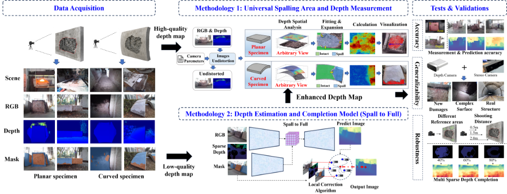

# Spall-to-Full

Official research code for the depth-completion component of the manuscript
**“Semantics Guided RGB-D Quantification of Fire-induced Concrete Spalling.”**

Spall-to-Full completes noisy or sparse metric depth maps of fire-damaged
concrete by combining RGB appearance, sparse depth observations, and a
three-class semantic mask (background, intact concrete, and spalled concrete).
The separate spalling measurement code is available in the
https://github.com/MikeyDong/Spall-Depth-and-area-measurement-from-Single-RGBD-image-arbitrary-view.



## Repository contents

| Path | Purpose |
| --- | --- |
| `train_spall2full.py` | Fine-tune Spall-to-Full from the released Any2Full ViT-L checkpoint. |
| `test_spall_to_full.py` | Run inference and quantitative evaluation on one or more sparse-depth test conditions. |
| `model/ours/` | Model implementation and semantic-mask conversion utility. |
| `requirements.txt` | Python dependencies for the reported CUDA 12.1 environment. |

## Code, data, and weights

| Item | Location | Access code / expected local path |
| --- | --- | --- |
| Training and validation data | [Baidu Netdisk](https://pan.baidu.com/s/1CKtUdeUk33h2RJbShvrsAQ) | Code: `54hj` |
| Test data | [Baidu Netdisk](https://pan.baidu.com/s/1THFZ6zij-hYK9cplbhpjfA) | Code: `123h` |
| Final Spall-to-Full checkpoint | [Baidu Netdisk](https://pan.baidu.com/s/1lBauxafJxa16T1QPokWPlw) | Code: `yh8s`; |
| Any2Full ViT-L initialization checkpoint | [Official Any2Full repository](https://github.com/zhiyuandaily/Any2Full) | Save as `checkpoints/Any2Full_vitl.pth.tar` for training. |
| Real world test | [Baidu Netdisk](https://pan.baidu.com/s/1csMPP1oGWuDfeXJL-smODg)) | Code: `43ja`; In this test set, the burst regions
were designated as ROIs (pixel value = 2), and only the pixels within these regions were used to compute the error metrics.|


## Environment and installation

The experiments reported in the manuscript used Python 3.11.8, PyTorch 2.2.2,
CUDA 12.1, and NumPy 1.26.4. The reported training configuration used a ViT-L
model, 1456 × 1456 inputs, batch size 1. Training at
the resolution of 1456 × 1456 may not fit on lower-memory GPUs.

The commands below are for a Linux shell:

```bash
git clone https://github.com/MikeyDong/Spall-to-Full.git
cd Spall-to-Full

python3.11 -m venv .venv
source .venv/bin/activate
python -m pip install --upgrade pip
python -m pip install -r requirements.txt
```

## Input conventions

All modalities belonging to an image must have the same filename stem, for
example `sample_001.jpg`, `sample_001.png`, and `sample_001.png` in their
respective directories.

| Input | Required representation |
| --- | --- |
| RGB | Three-channel images. |
| Metric depth | Single-channel depth image. The released data and default commands use millimetres, with zero denoting invalid or missing depth. Sixteen-bit PNG is recommended. |
| Training semantic mask | Three-channel PNG with channel order `[background, intact concrete, spalled concrete]`. |
| Evaluation semantic mask | Single-channel label image with `0 = background`, `1 = intact concrete`, and `2 = spalled concrete`. The evaluation script converts it to one-hot form internally. |
| Evaluation ROI mask | Single-channel image; every nonzero pixel is included in the foreground ROI. |

If the training annotations are single-channel class-label PNGs, convert them
to three-channel one-hot masks with:

```bash
python model/ours/build_onehot_masks.py \
  --input-dir data/mask_labels \
  --output-dir data/mask_onehot
```

## Training

### 1. Arrange the data and initialization checkpoint

The default paths in `train_spall2full.py` expect:

```text
Spall-to-Full/
├── checkpoints/
│   └── Any2Full_vitl.pth.tar
└── data/
    ├── rgb/
    ├── Depth/
    ├── mask_onehot/
    └── Val/
        ├── rgb/
        ├── Depth/
        └── mask_onehot/
```

The published split contains 553 training images and 138 validation images
(691 images in total). If all 691 triplets are initially placed in the three
top-level training directories and the `data/Val/` directories are empty, the
script uses seed 42 to select 20% for validation. **This operation physically
moves the selected RGB, depth, and mask files into `data/Val/`.** Keep a backup
of the downloaded archive. If a validation split is already present, retain the
published 553/138 split and do not repartition it.

Training images must be at least `EXPECTED_SIZE × EXPECTED_SIZE` because the
default pipeline samples four random crops per image per epoch. Validation
images are resized to that size.

### 2. Review the configuration

Paths and hyperparameters are constants near the beginning of
`train_spall2full.py`; the script does not currently expose them as command-line
arguments. The manuscript configuration is already the default:

| Setting | Default |
| --- | ---: |
| Input size | 1456 × 1456 |
| Batch size | 1 |
| Epochs | 30 |
| Random crops per training image | 4 |
| Training/validation ratio | 80/20 |
| Random seed | 42 |
| Optimizer / learning rate | Adam / 5 × 10⁻⁵ |
| Maximum supervised depth | 3000 mm |
| Synthetic training deletion | 60% of all image positions |

### 3. Start training

Run the command from the repository root:

```bash
python train_spall2full.py
```

The script writes the following files to `outputs/`:

* `train_val_log.csv`: per-epoch training and validation losses;
* `last_model.pth`: checkpoint from the most recent epoch;
* `epoch_15_model.pth`: additional epoch-15 checkpoint;
* `best_model.pth`: checkpoint with the lowest validation total loss.

The saved checkpoint dictionaries contain `model_state`, `optimizer_state`,
`epoch`, `best_val`, and the training/validation loss summaries. The evaluation
script accepts this format directly.

Please use the Last model as the final model and conduct testing.

## Evaluation and testing

### 1. Arrange the test inputs

Extract the released test archive. The folder names may be different from the
example below; map the actual folders to the corresponding command-line
arguments:

```text
data/test/
├── rgb/
├── depth_inputs/
│   ├── delete_40/
│   ├── delete_60/
│   └── delete_80/
├── semantic_masks/
├── gt_depth/
└── roi_masks/
```

Each sparse-depth directory is treated as a separate test case, and its folder
name is used in the output tables. The released quantitative test set contains
26 images. All input types are paired by filename stem; an image with a missing
pair is skipped and reported in the terminal.

### 2. Run the released evaluation

Replace the checkpoint filename and, if necessary, the extracted folder names:

```bash
python test_spall_to_full.py \
  --rgb_dir data/test/rgb \
  --depth_input_dirs \
    data/test/depth_inputs/delete_40 \
    data/test/depth_inputs/delete_60 \
    data/test/depth_inputs/delete_80 \
  --mask_dir data/test/semantic_masks \
  --gt_depth_dir data/test/gt_depth \
  --roi_mask_dir data/test/roi_masks \
  --checkpoint checkpoints/spall_to_full.pth \
  --out_root outputs/evaluation \
  --encoder vitl \
  --model_input_size 1456 \
  --depth_scale 1.0 \
  --save_npy
```

`--depth_scale` is the number by which values read from depth images are divided.
Use the default `1.0` when the files already store millimetres. For example, use
`1000` only if an integer image stores 1000 units per millimetre. Run
`python test_spall_to_full.py --help` for all optional arguments.

### 3. Expected outputs

For each sparse-depth case, the script creates:

```text
outputs/evaluation/<case>/
├── Spall_to_Full/
│   ├── 01_predictions/
│   ├── 02_colorized_predictions/
│   ├── 03_gt_prediction_comparisons/
│   └── 04_metrics/
├── <case>_metrics.xlsx
├── <case>_per_image_metrics.csv
└── <case>_summary.csv
```

It also creates cross-case files in `outputs/evaluation/`:

* `all_cases_metrics.xlsx`;
* `all_cases_per_image_metrics.csv`;
* `all_cases_summary.csv`.

The primary manuscript metrics are MAE and RMSE in millimetres, evaluated over
the supplied foreground ROI containing intact and spalled concrete. With the
released 26-image quantitative test set, the exact released sparse-depth maps,
ROI masks, and final 1456 checkpoint, the manuscript reports:

| Valid-depth deletion ratio | MAE (mm) | RMSE (mm) |
| ---: | ---: | ---: |
| 40% | 4.4 | 9.3 |
| 60% | 6.0 | 13.0 |
| 80% | 7.8 | 15.9 |

These values are reference aggregate results. Small numerical differences may
occur across GPU models and software builds; large differences usually indicate
an input-unit, filename-pairing, semantic-label, ROI, resolution, or checkpoint
mismatch.

## Using another model input size

The published model uses 1456. Lower-resolution experiments can be run by
changing `EXPECTED_SIZE` in `train_spall2full.py`, training a new checkpoint,
and evaluating that checkpoint with the same value passed to
`--model_input_size`. For example, a 1036 model requires:

```python
# train_spall2full.py
EXPECTED_SIZE = 1036
```

```bash
python test_spall_to_full.py ... --model_input_size 1036
```

The input size and checkpoint must match. Do not change the model patch size.

## Citation

The manuscript is currently under assessment. Bibliographic citation details
will be added after publication.
